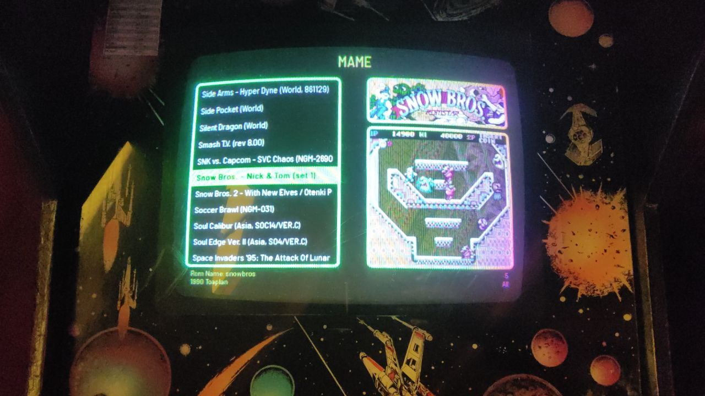

# Attract-Mode personal layout

This is a personal layout for the [Attract-Mode Plus](https://github.com/oomek/attractplus) front-end, based on de Basic layout.



### Installation

```bash
git clone https://github.com/dubcl/am-dub-layout.git dub
```

### Changes

- Boxes color to green
- Selection color to green
- List align to left
- Footer information
  - Rom name
  - Rom year and manufacturer
  - Played count
  - Filter name